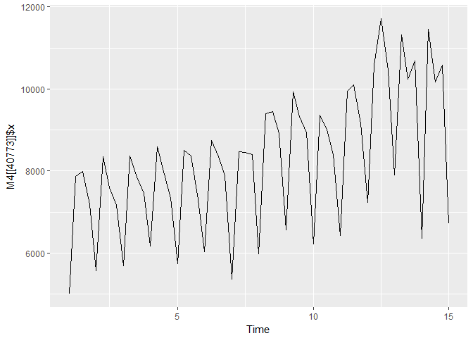

<!-- README.md is generated from README.Rmd. Please edit that file -->
M4comp2018
==========

The R package M4comp2018 contains the 100000 time series from the M4-competition. It also includes the true future values (the test part) and the submitted forecasts of the top25 participants.

Installation
------------

``` r
install.packages("https://github.com/carlanetto/M4comp2018/releases/download/0.2.0/M4comp2018_0.2.0.tar.gz",
                 repos=NULL)
```

Example
-------

The `M4` object is a list with the series. Each element of this list is also a list with some components, like the series, the future values, type and domain and the submitted forecasts.

``` r
## check the components of the least
library(M4comp2018)
data(M4)
names(M4[[1]])
#>  [1] "st"     "x"      "n"      "type"   "h"      "period" "xx"    
#>  [8] "pt_ff"  "up_ff"  "low_ff"
#extract yearly series
yearly_M4 <- Filter(function(l) l$period == "Yearly", M4)
```

``` r
#plot one of the series, in red the future data
#in black, the hitorical data
plot(ts(c(M4[[40773]]$x, M4[[40773]]$xx),
        start=start(M4[[40773]]$x), frequency = frequency(M4[[40773]]$x)),
        col="red", type="l", ylab="")
lines(M4[[40773]]$x, col="black")
```



``` r
#read the help file for documentation
?M4comp2018
```

You can check the point forecasts subissions in the `$pt_ff` of each element of the list. Info about the submissions is in the submission\_info dataframe, the order of `$pt_ff` is the OWA ranking. Upper and Lower bound prediction intervals are found in `$up_ff` and `$low_ff` respectively.

``` r
?submission_info
```

``` r
M4[[1]]$pt_ff[1:3, ]
#>          [,1]     [,2]     [,3]     [,4]     [,5]     [,6]
#> [1,] 7243.994 7288.752 7333.678 7376.056 7423.142 7472.488
#> [2,] 7291.322 7333.897 7376.682 7419.546 7462.400 7505.190
#> [3,] 7172.993 7075.970 6997.268 6932.078 6876.902 6829.184
data(submission_info)
#check some info about top 3 sumbissions
submission_info[1:3,]
#>    ID        Type             Author(s)
#> 1 118      Hybrid                  Smyl
#> 2 245 Combination Montero-Manso, et al.
#> 3 237 Combination   Pawlikowski, et al.
#>                                  Affiliation Rank(OWA)
#> 1                          Uber Technologies         1
#> 2 University of A Coruna & Monash University         2
#> 3                          ProLogistica Soft         3
```

License
-------

This package is free and open source software, licensed under GPL-3
